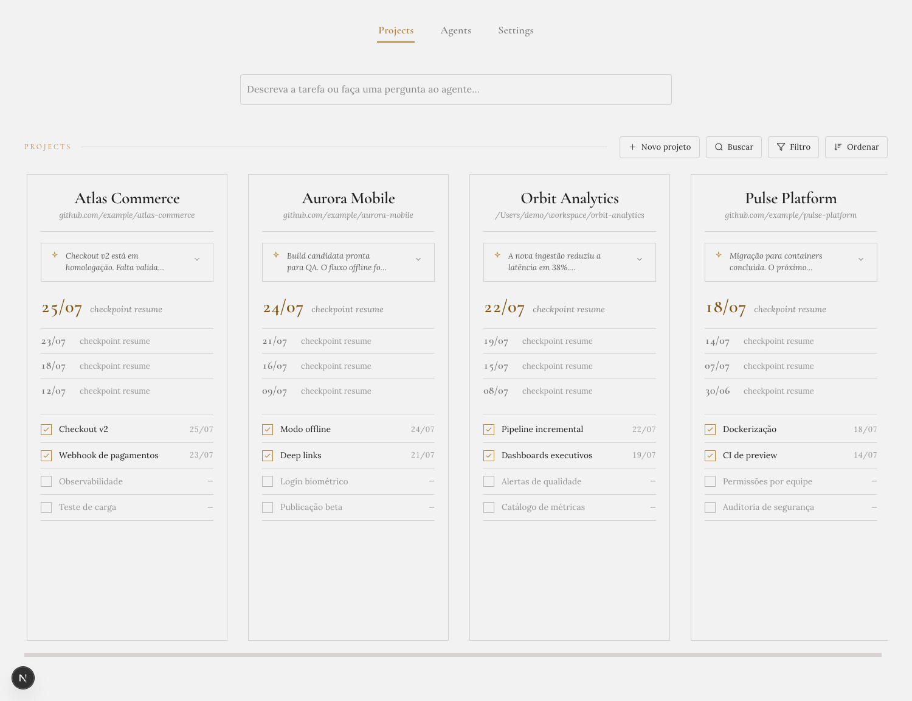
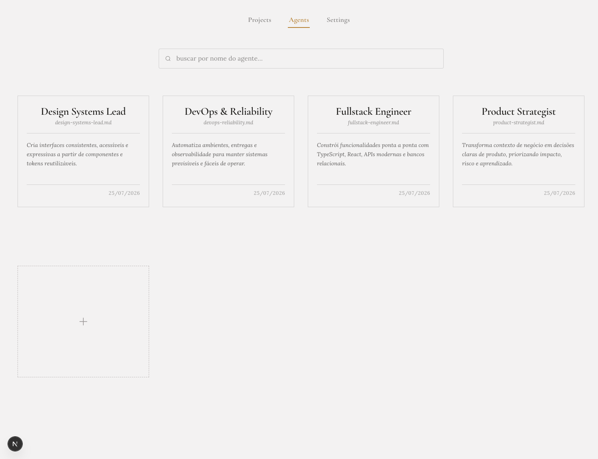
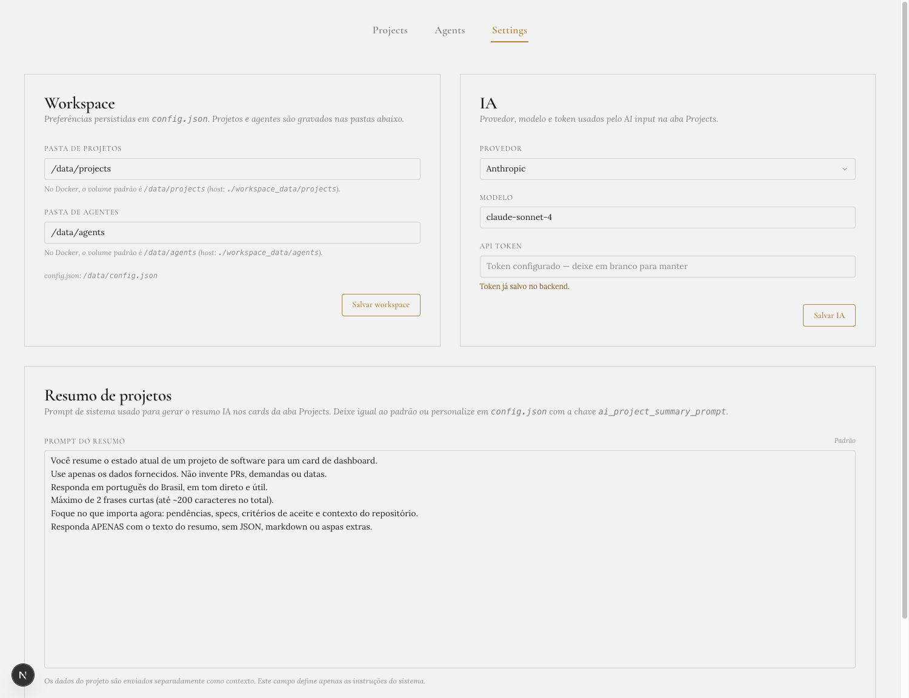

<br/>
<div align="center">

<h3 align="center">Dev Workspace</h3>
<p align="center">
Dashboard local para gerenciar projetos, agentes de IA e specs com rastreamento de progresso.
<br/>
<br/>
<a href="./docs/specs-workflow.md"><strong>Documentação do .specs »</strong></a>
<br/>
<br/>
  
<a href="https://github.com/davirezendemota/dev-workspace/issues/new?labels=bug">Report Bug .</a>
<a href="https://github.com/davirezendemota/dev-workspace/issues/new?labels=enhancement">Request Feature</a>
</p>
</div>

## About The Project

Dev Workspace é um painel que **lê o `.specs/` de cada repositório vinculado** e oferece interface sobre andamento, tasks, pendências, resumo de IA e integrações. Os repos de produto mantêm `.specs/` genérico (specs + checklist); o **agent-cli consulta o DW**, não o `.specs` diretamente, para status operacional.

Principais capacidades:

- **Projects** — repos locais ou GitHub; DW lê `.specs/spec-checklist.json` e specs do repo
- **Agents** — biblioteca de agentes de IA reutilizáveis
- **Settings** — pastas, provider de IA e prompt de resumo
- **AI input** — perguntas contextuais sobre projetos
- **AI summary** — resumo de status derivado das specs
- **Tasks** — tarefas do projeto (embedded no registro DW)
- **Bridge** — `install-kit/` instala `.dev-workspace/.env`, consumidor MCP e skill nos consumidores

Separação: [.specs/](./docs/specs-workflow.md) no repo · **MCP + skill `dev-workspace`** para o agente consumir o DW.

## Screenshots

### Projects



### Agents



### Settings



### Built With

Principais tecnologias usadas no projeto:

- [Next.js](https://nextjs.org/)
- [React](https://react.dev/)
- [TypeScript](https://www.typescriptlang.org/)
- [Tailwind CSS](https://tailwindcss.com/)
- [i18next](https://www.i18next.com/)
- [react-markdown](https://github.com/remarkjs/react-markdown)
- [Docker](https://www.docker.com/)
## Getting Started

Siga os passos abaixo para rodar o Dev Workspace localmente ou via Docker Compose.
### Prerequisites

- Node.js 20+ e npm
- Docker e Docker Compose (opcional, recomendado para ambiente consistente)
- Pasta no host para montar projetos locais (ex.: `/Users/davi/workspace`)
### Installation

**Opção A — Docker Compose (recomendado)**

1. Clone o repositório
   ```sh
   git clone git@github.com:davirezendemota/dev-workspace.git
   cd dev-workspace
   ```
2. Copie as variáveis de ambiente
   ```sh
   cp .env.example .env
   ```
3. Ajuste `WORKSPACE_LOCAL_PROJECTS_ROOT` no `.env` para a pasta onde seus repos locais ficam
4. Suba o ambiente desejado
   ```sh
   # Dev com hot reload (porta 3010)
   docker compose -f compose.yaml up -d

   # Build local / staging (porta 8080)
   docker compose -f compose.build.yaml up -d

   # Production via GHCR (porta 3000)
   docker compose -f compose.production.yaml up -d
   ```
5. Acesse a porta do ambiente (`3010`, `8080` ou `3000`)

**Opção B — desenvolvimento local**

1. Clone e instale dependências
   ```sh
   git clone git@github.com:davirezendemota/dev-workspace.git
   cd dev-workspace
   npm install
   ```
2. Copie `.env.example` para `.env`
3. Inicie o servidor de desenvolvimento
   ```sh
   npm run dev
   ```
4. Dados persistidos em `./workspace_data/` (config, projects, agents)
## Usage

1. Abra **Settings** e configure `projects_folder`, `agents_folder` e (opcional) provider/model/token de IA.
2. Na aba **Projects**, adicione projetos Manual, Manual · repo ou GitHub.
3. Na aba **Agents**, cadastre agentes com instruções em Markdown.
4. Use o **AI input** na aba Projects para perguntas contextuais (requer IA configurada).
5. Consulte a [documentação do `.specs`](./docs/specs-workflow.md) para entender a estrutura, o fluxo e como reutilizá-lo em outros projetos.

Comandos úteis de agente (Cursor/Claude): `/bootstrap-specs`, `/update-specs`, `/new-spec`, `/spec-checklist`.

## Bridge — conectar outros projetos ao Dev Workspace

Um comando instala **`.dev-workspace/.env`**, **consumidor MCP** (`.cursor/mcp.json`) e **skill `dev-workspace`**.

```bash
./install-kit/install.sh /path/to/consumer --dw-root /path/to/dev-workspace
```

- **MCP:** servidor único no DW (`localhost:3011/mcp` em dev); cada repo = consumidor com token scoped.
- **Token consumidor:** `GET /api/projects/{id}/connection` na UI DW (não use admin no repo consumidor).

- **Specs no repo** → `.specs/`
- **Planejamento, checkpoints (PDF), pendências, tasks, resumo IA** → MCP (preferido) ou skill `dev-workspace`

Ver [install-kit/README.md](./install-kit/README.md) e [mcp-server/README.md](./mcp-server/README.md).
## Roadmap

- [x] Settings (pastas, IA, prompt de resumo)
- [x] CRUD de projetos (Manual, repo local, GitHub)
- [x] CRUD de agentes
- [x] AI input na aba Projects
- [x] AI summary de status do projeto
- [x] Checklist editável para projetos Manual (sem repo)
- [x] Autenticação nos endpoints da API (Bearer token; exibido nos logs do container)
- [ ] Edição completa do JSON de projeto pela UI
- [ ] Re-sync periódica de projetos GitHub

See the [open issues](https://github.com/davirezendemota/dev-workspace/issues) for a full list of proposed features (and known issues).
## Contributing

Contribuições são bem-vindas. Antes de implementar uma feature:

1. Leia ou crie a spec em `.specs/features/`
2. Registre/atualize o item em `.specs/spec-checklist.json`
3. Abra um PR referenciando a spec e os ACs atendidos

Fluxo sugerido:

1. Fork o projeto
2. Crie uma branch (`git checkout -b feature/minha-feature`)
3. Commit (`git commit -m 'feat: descreva a mudança'`)
4. Push (`git push origin feature/minha-feature`)
5. Abra um Pull Request

## Contributors

Obrigado a todas as pessoas que contribuíram para este projeto:

<a href="https://github.com/davirezendemota/dev-workspace/graphs/contributors">
  
</a>

## License

Distributed under the MIT License. See [MIT License](https://opensource.org/licenses/MIT) for more information.
## Contact

Davi Rezende — [GitHub @davirezendemota](https://github.com/davirezendemota)

Project Link: [https://github.com/davirezendemota/dev-workspace](https://github.com/davirezendemota/dev-workspace)
## Acknowledgments

Recursos e projetos que inspiraram este workspace:


- [makeread.me](https://github.com/ShaanCoding/makeread.me)
- [Best README Template (Othneil Drew)](https://github.com/othneildrew/Best-README-Template)

## Notice

This ReadMe was generated using [makeread.me](https://github.com/ShaanCoding/makeread.me) 🚀
